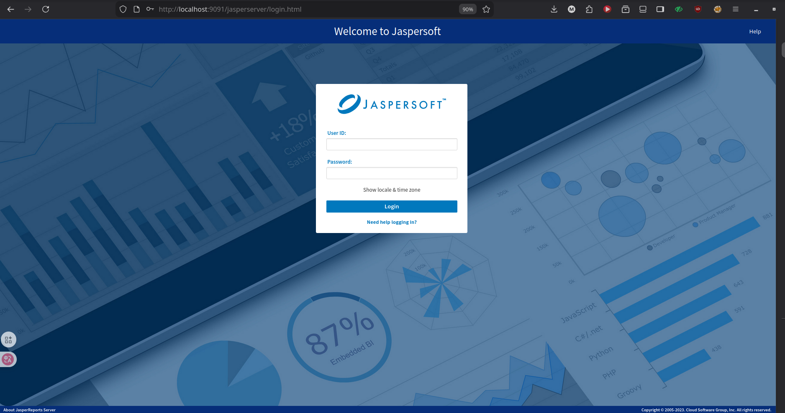

<!-- Header Image -->
<p align="center">
  
</p>

# Enterprise Docker Environment  
## Oracle ADB Free 26ai + JasperReports Server 8.2

This repository provides a **local, container-based environment** for:

- Running **Oracle Autonomous Database Free 26ai** in a Docker container  
- Running **JasperReports Server 8.2 (Community Edition)** with MariaDB  
- Preparing the foundation to connect JasperReports to Oracle as a reporting data source  

The project is organized as two main stacks:

- `oracle-adb-container-26ai/` → Oracle ADB Free 26ai  
- `jasper_report/` → JasperReports Server + MariaDB  
- `image/` → Screenshots and reference images  

---

## 📂 Repository Structure

```text
Docker/
├── README.md
├── image/
│   └── Screenshot_20251119_221725.png
│
├── oracle-adb-container-26ai/
│   └── docker-compose.yaml
│
└── jasper_report/
    ├── docker-compose.yaml
    └── ojdbc8.jar/
```

---

## 🧱 1. Oracle ADB Free 26ai Stack

Path: `./oracle-adb-container-26ai/docker-compose.yaml`

This stack runs an Oracle ADB Free 26ai container:

```yaml
image: ghcr.io/oracle/adb-free:latest-26ai
container_name: oracle-adb-26ai
hostname: oracle-adb
networks:
  - oracle-adb-network
ports:
  - "1521:1522"
  - "1522:1522"
  - "8443:8443"
  - "27017:27017"
  - "8888:8888"
...
volumes:
  oracle-adb-data:
    external: true
  oracle-adb-logs:
    external: true
networks:
  oracle-adb-network:
    external: true
```

### ▶️ Start Oracle ADB

Before running the stack:

```bash
docker network create oracle-adb-network
docker volume create oracle-adb-data
docker volume create oracle-adb-logs
```

Then start:

```bash
cd oracle-adb-container-26ai
docker compose up -d
```

---

## 📊 2. JasperReports Server + MariaDB Stack

Path: `./jasper_report/docker-compose.yaml`

```yaml
services:
  web:
    container_name: jasperreports
    image: 8d40ab0e0087
    restart: always  
    depends_on:
      - db
    ports:
      - "9091:8080"
    volumes:
      - 'jasperreports_data:/bitnami/jasperreports'
    environment:
      - JASPERREPORTS_USERNAME=jasperadmin
      - JASPERREPORTS_PASSWORD=jasperadmin
      - JASPERREPORTS_DATABASE_HOST=mariadb
      - JASPERREPORTS_DATABASE_PORT_NUMBER=3306
...
  db:
    image: bitnami/mariadb:latest
    environment:
      - MARIADB_USER=bn_jasperreports
      - MARIADB_PASSWORD=bitnami
      - MARIADB_DATABASE=bitnami_jasperreports    
    volumes:
      - mariadb_data:/bitnami/mariadb
```

### ▶️ Start JasperReports

```bash
cd jasper_report
docker compose up -d
```

### 🌐 Access JasperReports

```
http://localhost:9091/jasperserver
```

Default login:
- **username:** jasperadmin  
- **password:** jasperadmin  

---

## 🔗 Connecting JasperReports to Oracle ADB

To use Oracle ADB as a reporting datasource:

### 1️⃣ Add Oracle JDBC driver  
Place `ojdbc8.jar` inside:

```
Docker/jasper_report/ojdbc8.jar/
```

### 2️⃣ Create a Data Source in JasperReports

Connection URL example:

```text
jdbc:oracle:thin:@oracle-adb-26ai:1522/ORCLPDB1
```

---

## 👤 Author

**Eng. Malek Mohammed Al-edresi**  
Oracle APEX & Database Developer  
AI • Vector Search • DevOps • Reporting
